# 📋 今日医美资讯速览 | Medical Aesthetics Roundup
**2026年5月31日 / May 31, 2026**

---

## 🇨🇳 中文版

📋 今日医美资讯速览 — 2026年5月31日

#1 GLP-1减肥药禁止在电商销售，行业野蛮增长态势要终结了
   来源：第一财经
   GLP-1减肥药在电商渠道被全面叫停，行业从野蛮增长转向规范发展。监管部门重拳出击，要求相关产品回归医疗本质，通过正规医疗机构进行推广和销售。

#2 2026医美大变局：监管重拳落地，行业洗牌加速
   来源：新浪财经
   2026年医美行业正从"野蛮生长"走向"规范发展"。监管层密集出台政策，对不合规机构形成强大震慑。业内人士指出，坚守合规底线、深耕专业技术，才能在这场大变局中站稳脚跟。

#3 细胞疗法大降价！离平民抗衰还有多远？
   来源：第一财经
   我国现存超10万家细胞疗法相关企业，随着5月1日细胞治疗价格大幅下调，抗衰疗法加速走向平民化。但行业的规范与安全仍是关注焦点。

#4 中信证券：医美上游品牌方因发展阶段而分化
   来源：第一财经
   中信证券研报指出，医美上游品牌方因发展阶段不同而出现明显分化，下游医美机构议价能力边际提升，行业格局正在重塑。

#5 2026年医美行业深度观察：当"容貌焦虑"遇上"理性消费"
   来源：搜狐
   2026年的医美市场正在从"敢不敢做"走向"会不会选"。那些靠信息差、靠忽悠、靠低价获客的机构正在被加速淘汰，而靠透明、靠专业、靠真实口碑的品牌正在迎来最好的时代。

#6 2026中国"医美+AI"产业分析：万亿级市场规模与智能化合规路径
   来源：知乎/OpenAxo
   深度解析2026年中国"医美+AI"产业趋势。结合卫健委与药监局最新监管政策，洞察万亿级轻医美市场的数智化重构逻辑，拆解智能皮肤检测、AI辅助诊疗等高价值应用场景。

#7 被中国消费者"放弃"的韩国化妆品，正在打开美国市场
   来源：第一财经
   中国曾是韩国化妆品的最大海外买家，如今韩国化妆品正在加速转向美国市场，折射出全球美妆消费格局的深刻变化。

#8 2026年医美行业深度观察：从规模扩张到质量重塑的转型之路
   来源：搜狐
   标准化成为共识，合规化成为基础，质量化成为方向。能够顺应时代潮流、坚守医疗初心、持续创新进取的机构将成为行业变革的引领者。

---
数据来源：crawl4ai 全网搜索 | 生成时间：2026-05-31

---

## 🇬🇧 English Version

📋 Medical Aesthetics Roundup — May 31, 2026

#1 The Future of the Aesthetics Industry: Key Takeaways from Medical Spa Show 2026
   Source: AmSpa
   The Medical Spa Show 2026 highlighted the industry's shift toward personalized treatments, regenerative medicine integration, and AI-powered practice management. Key conversations centered on patient safety, regulatory compliance, and the growing demand for non-surgical procedures.

#2 New Radiesse Research Highlights Deeper Extracellular Matrix Regeneration
   Source: Merz Aesthetics / AmSpa
   New clinical research from Merz Aesthetics demonstrates that Radiesse (calcium hydroxylapatite) stimulates deeper extracellular matrix regeneration, offering longer-lasting collagen stimulation and improved skin quality beyond traditional volume restoration.

#3 Top 7 Aesthetic Trends in 2026, According to Facial Plastic Surgeons
   Source: Spiegel Center
   Facial plastic surgeons identify deep plane facelifts, early-intervention surgery, beautification facelifts, and neck lifts as standalone procedures among the top trends. The emphasis is on natural-looking results and strategic treatment planning.

#4 Plastic Surgery Trends for 2026: Preservation and Regeneration
   Source: ASPS (American Society of Plastic Surgeons)
   2026 marks a decisive move toward preservation techniques and regenerative sculpting. Key trends include anatomy-preserving surgery, regenerative aesthetics (PRP, PRF, exosomes), prejuvenation for patients in their 20s and 30s, and GLP-1 weight loss makeovers.

#5 The Best Beauty Gadgets and In-Office Treatments
   Source: ELLE
   From RF microneedling devices to LED light therapy masks, the latest beauty gadgets and in-office treatments are redefining at-home and professional skincare. Combination therapies offering synergistic results are leading the market.

#6 Top Aesthetic Medicine Trends to Watch in 2026
   Source: IAPAM
   Non-surgical treatments continue to dominate with patients seeking natural-looking results. Key trends include treatment stacking for synergistic effects, full-face Botox for balanced rejuvenation, and long-term aesthetic planning over quick fixes.

#7 Medical Aesthetics Industry News & Regulatory Updates 2026
   Source: Templus Life
   Device regulations are evolving, exosome therapy advances continue, and the market for non-surgical treatments keeps growing. The industry is seeing increased focus on patient education and evidence-based practice.

#8 Plastic Surgery Trends 2026: What Patients Should Know This Spring
   Source: Orange County Plastic Surgery
   Spring 2026 trends center on post-GLP-1 body contouring, natural-looking breast augmentation, collagen-stimulating technologies, and hybrid surgical-nonsurgical treatment plans that prioritize rapid recovery.

---
Data sourced via crawl4ai | Generated: 2026-05-31

---

## 🖼️ 配图 / Gallery

*以下图片来自各新闻源文章配图，真实来源于网络下载*

  
  
  
  
  
  
  
  
  
  
  
  
  
  
  
  
  
  
  
  
  
  
  
  
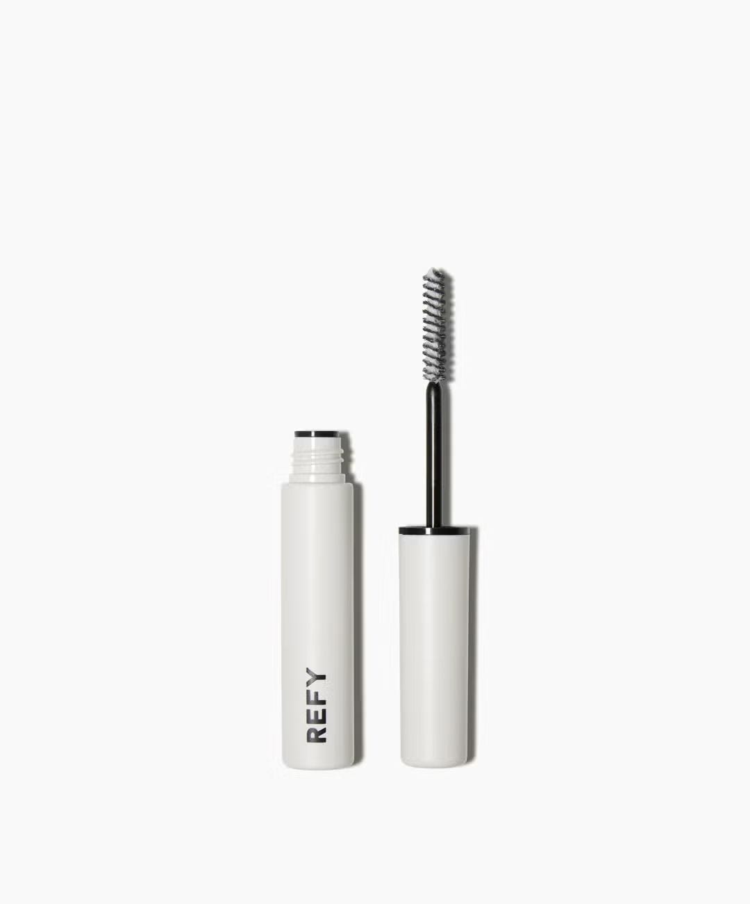  
  
  
  
  
  
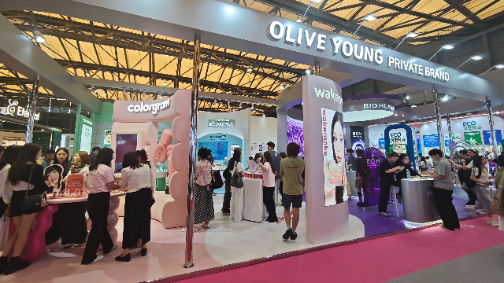  
  
  
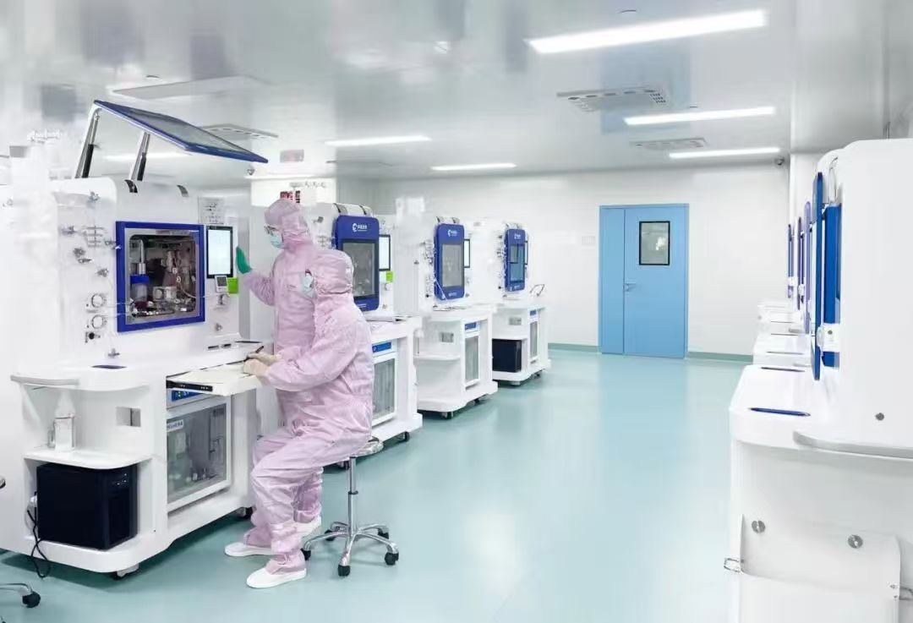  
  
  
  
  
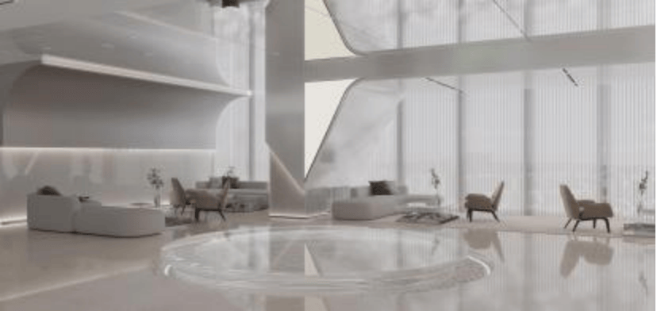  
  
  
  
  
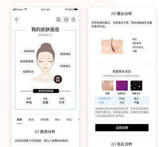  
  
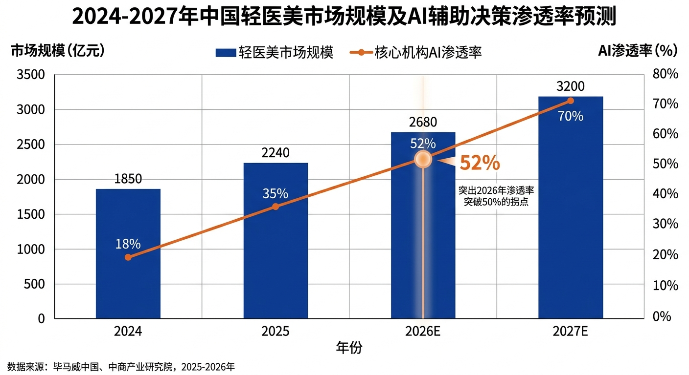  
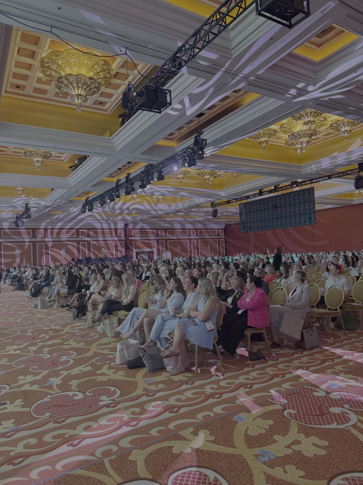  
  
  
  
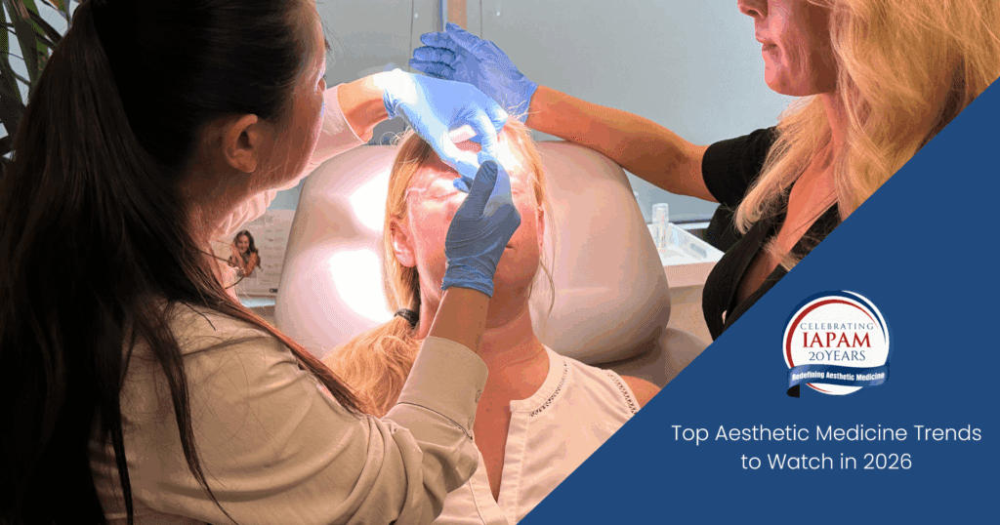  
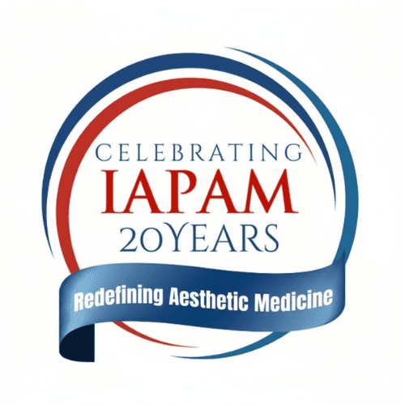  
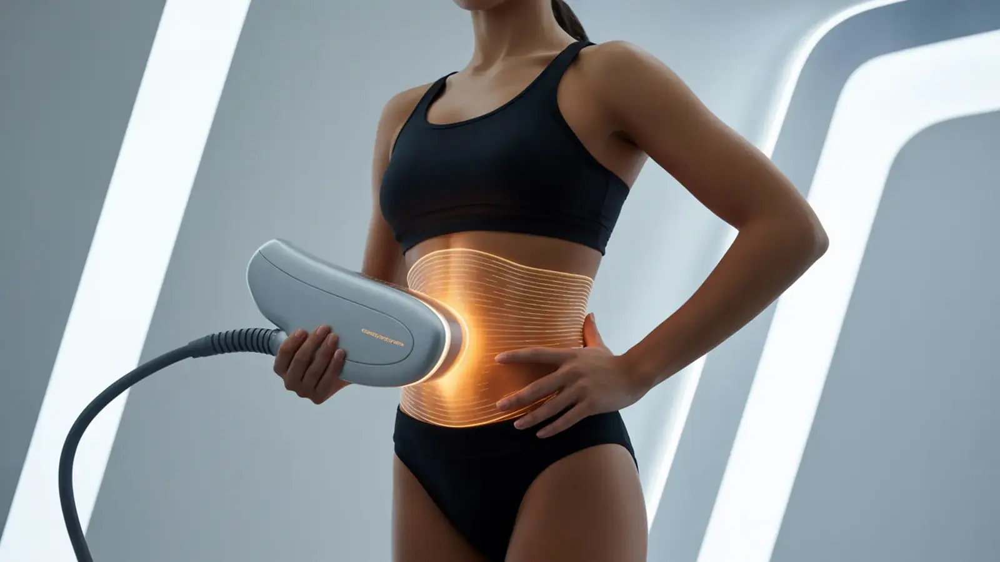  
  
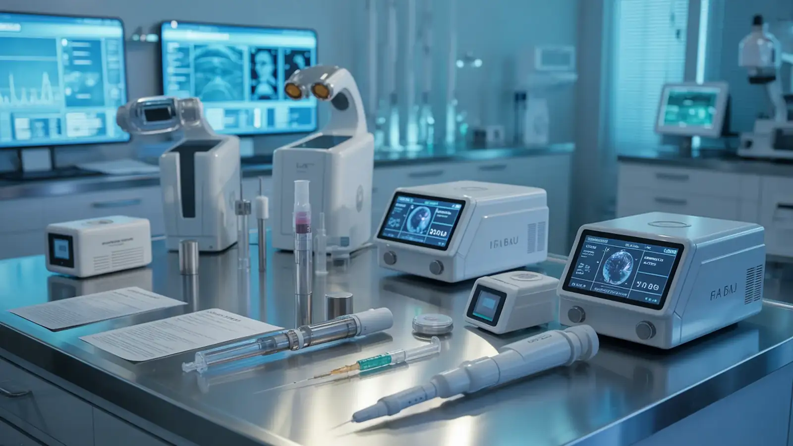  

---
*共 55 张配图，均来自网络新闻源文章 | Generated via crawl4ai*